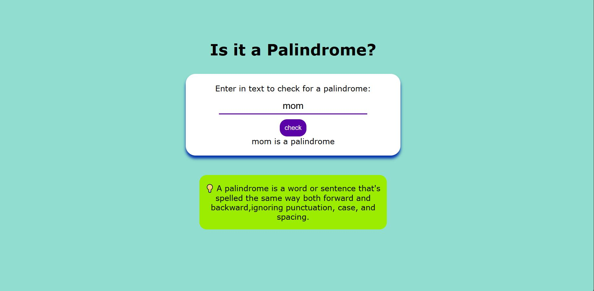

# Palindrome-Checker 🚀

## Overview📝

The Palindrome Checker is a simple yet effective tool designed to determine whether a given string is a palindrome. A palindrome is a word, phrase, number, or any sequence of characters that reads the same forward and backward, ignoring spaces, punctuation, and capitalization.

## Demo 📸

## Features

. Input Handling: Accepts user input via a text field.
. Normalization: Removes all non-alphanumeric characters and converts the 
  string to lowercase to ensure accurate palindrome checking.

## Technologies Used 🛠️

- HTML
- CSS
- Javascript

## Getting Started

Prerequisites
To run this project, you need a modern web browser that supports HTML5, CSS3, and JavaScript.

## Installation 💻

1. Clone the repository
   git clone <git@github.com>:faridafaqiri/Palindrome-Checker.git
2. Navigate to the project directory:
   cd Palindrome-Checker

## Contributing

Contributions are welcome! Please fork the repository and submit a pull request with your improvements.

## Author 👩‍💻

You can contact me through the following:

- LinkedIn: (<https://www.linkedin.com/in/farida-faqiri-071a31309/>)
- Email: (<farida.faqiri2@gmail.com>)
